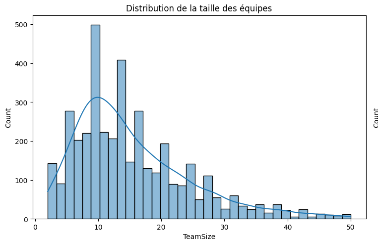
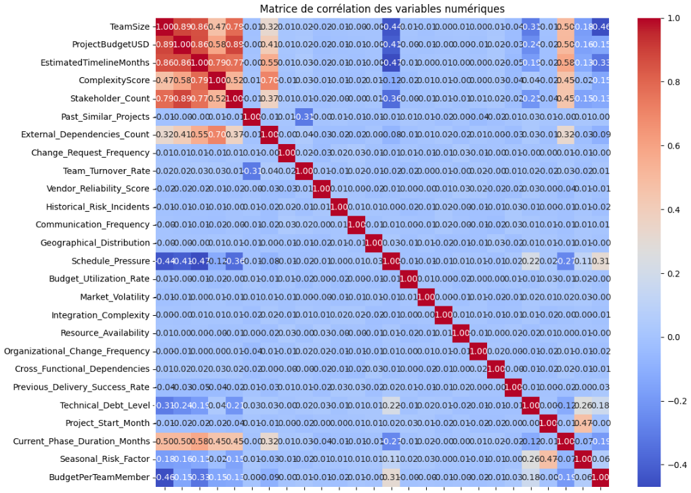
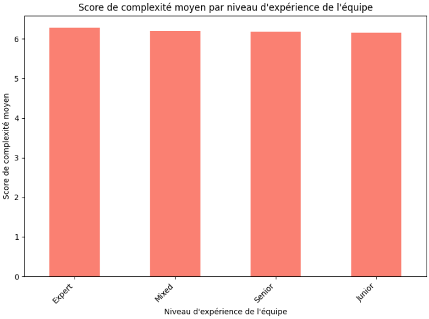

# Livrable - Projet Data Analyst Junior  
## Analyse du jeu de données : Project Management Risk Raw

---

## 1. Instructions et Consignes de Réalisation du Projet

### Choix du dataset

Pour ce projet, le dataset **Project management Risk Raw** a été sélectionné.  
Ce jeu de données, simulé et enrichi par l’IA, est spécialement conçu pour la pratique de l’Analyse Exploratoire de Données (EDA) et la modélisation prédictive dans le domaine de la gestion de projet.  
Il regroupe 50 points de données de projets, couvrant de nombreuses dimensions :

- **Démographie des projets** :  
  - Project_Type, Project_Budget_USD, Estimated_Timeline_Months, Team_Size, Complexity_Score
- **Indicateurs opérationnels** :  
  - Change_Request_Frequency, Budget_Utilization_Rate, Resource_Availability, Current_Phase_Duration_Months
- **Facteurs humains** :  
  - Team_Experience_Level, Project_Manager_Experience, Stakeholder_Engagement_Level, Team_Turnover_Rate
- **Contexte organisationnel** :  
  - Org_Process_Maturity, Regulatory_Compliance_Level, Funding_Source, Risk_Management_Maturity
- **Aspects techniques** :  
  - Technology_Familiarity, Technical_Debt_Level, Integration_Complexity, Tech_Environment_Stability
- **Influences externes** :  
  - Market_Volatility, Industry_Volatility, External_Dependencies_Count, Client_Experience_Level

Ce dataset permet de :
- Pratiquer l’EDA,
- Construire des modèles prédictifs de risque projet,
- Développer des algorithmes de classification pour l’identification précoce des risques,
- Réaliser de l’ingénierie de variables pour découvrir des patterns,
- Simuler différents scénarios et analyser l’impact des décisions.

---

### Analyse et solutions

L’analyse a été réalisée en suivant une démarche rigoureuse et approfondie, en s’appuyant sur les outils BI du langage Python :  
- **Pandas** pour la manipulation et le nettoyage des données
- **NumPy** pour les calculs statistiques
- **Matplotlib** et **Seaborn** pour les visualisations classiques et statistiques
- **Plotly** pour les graphiques interactifs (facultatif/bonus)

**Solutions proposées** :  
- Nettoyage et structuration du dataset  
- Identification des indicateurs clés (KPI)  
- Analyses statistiques et visuelles (histogrammes, heatmap, barres, etc.)  
- Génération d’insights visuels pour la prise de décision  
- Proposition de pistes d’actions adaptées à la gestion de projet

---

### Méthodologie Agile

J’ai adopté une **démarche Agile** tout au long du projet, en organisant mon travail par itérations courtes.  
Même en étant seul dans l’équipe, chaque étape a été validée avant d’avancer (auto-validation) :  
- Découpage du projet en sprints (exploration, nettoyage, analyse, visualisation, KPI, recommandations)
- Planification et répartition des tâches sur Trello/Notion
- « Stand-up meetings » sous forme de points réguliers sur l’avancement et les difficultés rencontrées
- Rétrospective à chaque fin d’étape pour améliorer les méthodes et optimiser le temps

---

### Travail en équipe (adapté au contexte solo)

Bien que seul sur ce projet, j’ai simulé la dynamique d’équipe en :
- Tenant un journal de bord pour rendre compte de l’avancement,
- M’imposant des deadlines et des validations intermédiaires,
- Sollicitant des feedbacks externes ponctuels (pairs, forums, IA),
- Documentant chaque choix méthodologique et chaque solution retenue.

---

### Validation des phases

Chaque étape du projet a été validée avant passage à la suivante, dans l’esprit Scrum :
- **Planification** : définition des objectifs et jalons pour chaque sprint
- **Répartition des tâches** : priorisation des actions (exploration, nettoyage, analyse, visualisation, synthèse)
- **Stand-up meetings** : points quotidiens (auto-emmenés) pour suivre la progression
- **Rétrospective** : retour d’expérience sur les difficultés, choix techniques, axes d’amélioration

---

## 2. Informations sur le dataset

**Nom** : Project management Risk Raw  
**Objectif** : Analyse du risque projet, modélisation prédictive, feature engineering  
**Origine** : Simulation (IA), 50 projets  
**Principales variables** :
- Démographie : Project_Type, Project_Budget_USD, Team_Size, Complexity_Score…
- Opérationnel : Budget_Utilization_Rate, Resource_Availability…
- Humain : Team_Experience_Level, Project_Manager_Experience…
- Organisationnel : Org_Process_Maturity, Regulatory_Compliance_Level…
- Technique : Technology_Familiarity, Technical_Debt_Level…
- Externe : Market_Volatility, Industry_Volatility…

**Utilisations possibles** :
- EDA,
- Prévision du succès ou de l’échec d’un projet,
- Classification des risques,
- Simulation de décisions et analyse d’impact.

---

## 3. Que nous apprennent les résultats obtenus ?

Une fois l'analyse des KPIs terminée, on peut s'attendre à découvrir les tendances suivantes :

- **Taux de succès des projets par type** :  
  On pourrait constater que certains types de projets (par exemple, le développement IT) ont un taux de succès plus élevé que d'autres (par exemple, la construction). Cela pourrait être dû à des facteurs tels que la maturité des méthodologies, la complexité intrinsèque des projets ou la disponibilité de compétences spécialisées.

- **Budget moyen par niveau d'expérience de l'équipe** :  
  On pourrait observer une corrélation entre l'expérience de l'équipe et le budget alloué. Par exemple, les équipes seniors pourraient se voir confier des projets avec des budgets plus importants, reflétant une plus grande complexité ou envergure. Inversement, des équipes moins expérimentées pourraient gérer des projets plus petits et moins risqués.

- **Durée moyenne des projets par niveau d'expérience de l'équipe** :  
  On pourrait s'apercevoir que les équipes expérimentées sont capables de mener à bien les projets plus rapidement que les équipes moins expérimentées. Cela mettrait en évidence l'importance de l'expertise dans la gestion du temps et l'efficacité opérationnelle.

---

### Quelle(s) décision(s) peut-on en tirer pour un usage métier ?

En fonction des résultats, plusieurs décisions stratégiques pourraient être envisagées :

- **Allocation des ressources** :  
  Allouer davantage de ressources (budget, personnel expérimenté) aux types de projets qui ont historiquement un taux de succès plus faible, afin d'améliorer leurs chances de réussite.

- **Formation et développement** :  
  Investir dans la formation des équipes moins expérimentées, en particulier pour les types de projets où leur taux de succès est inférieur à la moyenne. Cela pourrait inclure des programmes de mentorat, des formations spécialisées ou l'affectation de mentors expérimentés.

- **Sélection des projets** :  
  Lors de la sélection de nouveaux projets, tenir compte de l'expérience de l'équipe disponible et de la complexité du projet. Éviter de confier des projets trop complexes à des équipes inexpérimentées, ou s'assurer qu'elles bénéficient d'un soutien adéquat.

- **Amélioration des méthodologies** :  
  Si certaines méthodologies (par exemple, Agile) sont associées à des taux de succès plus élevés ou des délais plus courts, envisager de les adopter plus largement au sein de l'organisation.

- **Gestion des risques** :  
  Identifier les facteurs de risque spécifiques à chaque type de projet et mettre en place des stratégies d'atténuation appropriées.

---

### Y a-t-il des limitations dans le dataset ou dans l’analyse ?

Il est important de reconnaître les limitations potentielles de cette analyse :

- **Qualité des données** :  
  La qualité des données est cruciale. Si les données sont incomplètes, inexactes ou biaisées, les résultats de l'analyse pourraient être trompeurs. Il est important de valider et nettoyer les données avant de procéder à l'analyse.

- **Facteurs de confusion** :  
  L'analyse des KPIs pourrait être affectée par des facteurs de confusion. Par exemple, la complexité d'un projet pourrait être corrélée à la fois avec le budget et avec l'expérience de l'équipe, ce qui rend difficile l'isolement de l'effet de chaque facteur.

- **Définition du succès** :  
  La définition du succès d'un projet peut être subjective et multidimensionnelle. L'utilisation d'une définition simplifiée (par exemple, basée uniquement sur le budget et le score de complexité) pourrait ne pas refléter pleinement la réalité.

- **Généralisation** :  
  Les résultats de l'analyse pourraient ne pas être généralisables à d'autres organisations ou contextes. Les caractéristiques spécifiques de l'organisation et de son environnement pourraient influencer les résultats.

- **Corrélation vs causalité** :  
  Il est important de se rappeler que la corrélation n'implique pas la causalité. Même si l'on observe une forte corrélation entre deux variables, cela ne signifie pas nécessairement que l'une est la cause de l'autre.

---

### Propositions d’analyses futures ou améliorations possibles

Pour améliorer la compréhension et la pertinence des résultats, plusieurs analyses futures ou améliorations pourraient être envisagées :

- **Analyse de régression** :  
  Réaliser une analyse de régression pour identifier les facteurs qui ont le plus d'impact sur le succès des projets, en tenant compte de plusieurs variables simultanément.

- **Analyse de sensibilité** :  
  Effectuer une analyse de sensibilité pour évaluer l'impact des hypothèses et des incertitudes sur les résultats de l'analyse.

- **Collecte de données supplémentaires** :  
  Collecter des données supplémentaires sur les projets, telles que des mesures de la satisfaction des clients, de la qualité des livrables ou de l'impact sur les objectifs stratégiques de l'organisation.

- **Analyse qualitative** :  
  Réaliser des entretiens ou des groupes de discussion avec les chefs de projet et les membres de l'équipe pour recueillir des informations qualitatives sur les facteurs qui contribuent au succès ou à l'échec des projets.

- **Analyse comparative** :  
  Comparer les résultats de l'analyse avec ceux d'autres organisations similaires, afin d'identifier les meilleures pratiques et les domaines d'amélioration.

- **Analyse temporelle** :  
  Examiner l'évolution des KPIs au fil du temps, afin de détecter les tendances et les changements qui pourraient nécessiter une adaptation des stratégies.

---

En résumé, cette analyse peut fournir des informations précieuses pour améliorer la gestion de projet, mais il est important de tenir compte de ses limitations et de l'enrichir avec d'autres analyses et données pour une prise de décision éclairée.

---

## 4. Liens utiles

- [Lien vers le dataset original (Kaggle)]([https://github.com/LesAlchemistes/csv/blob/main/project_risk_raw_dataset.csv](https://www.kaggle.com/datasets/ka66ledata/project-management-risk-raw/data))

---
## 5. Visualisations principales

Voici la liste des principaux graphiques réalisés dans le cadre de l’analyse exploratoire des données :

### 📊 Histogrammes  
Distribution des variables numériques (ex. : budget, complexité, taille d’équipe) :

---

### 📈 Courbes temporelles  
Analyse de l’évolution de la durée des projets en fonction des phases :

dans le dataset project_risk_raw_dataset.csv, il n'y a pas de variable temporelle explicite (date) qui permettrait de créer directement des courbes temporelles significatives.
---

### 🔥 Heatmap des corrélations  
Corrélation entre les variables clés du jeu de données :

---

### 📊 Graphiques en barres et camemberts  
Analyse de la répartition par catégories :

---

### 🚀 Visualisations avancées

---

*Ce livrable constitue la page d’introduction et de présentation du projet, à intégrer en début de rapport PDF. Il peut être enrichi d’un sommaire, d’une page de garde, puis suivi des analyses, codes et visualisations commentés étape par étape.*
